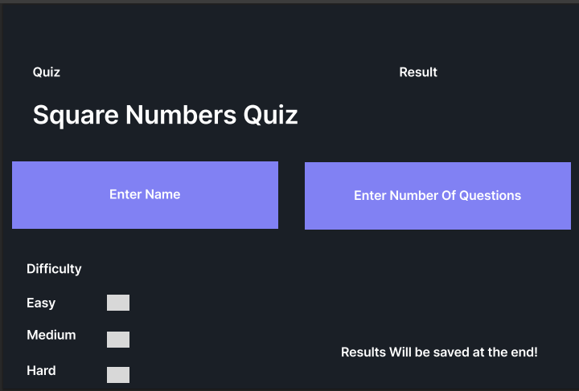
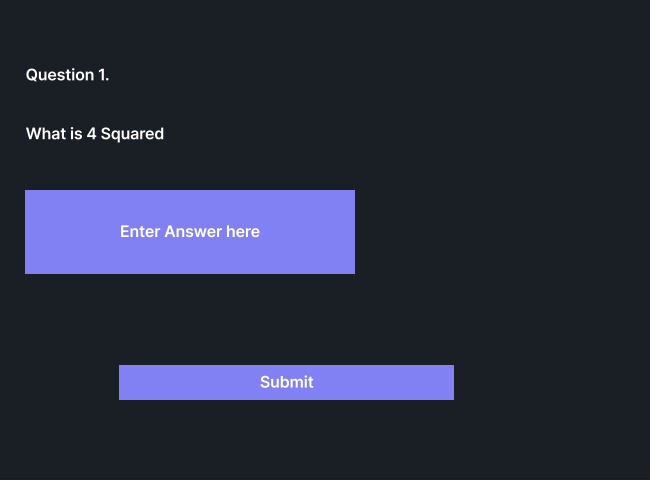
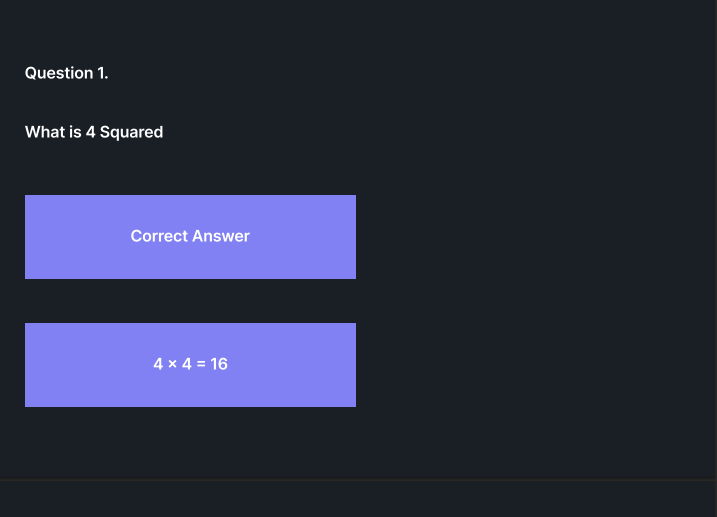
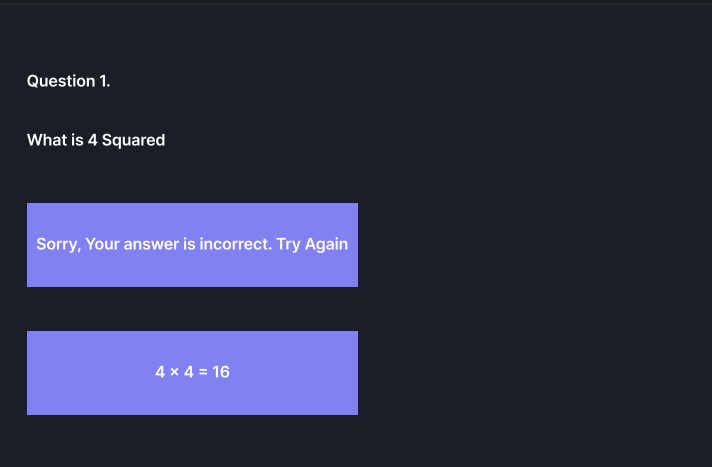
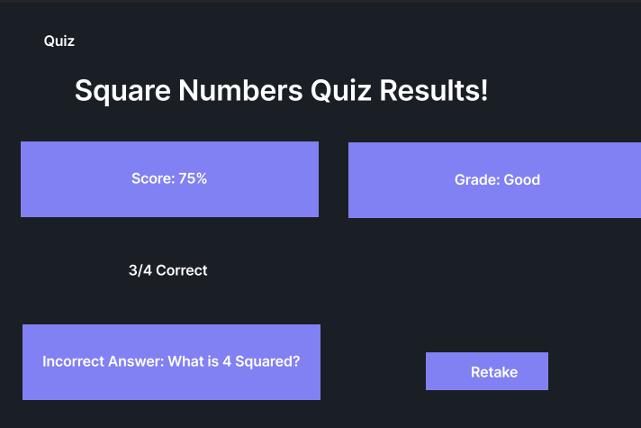
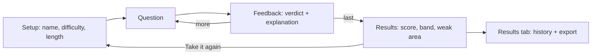
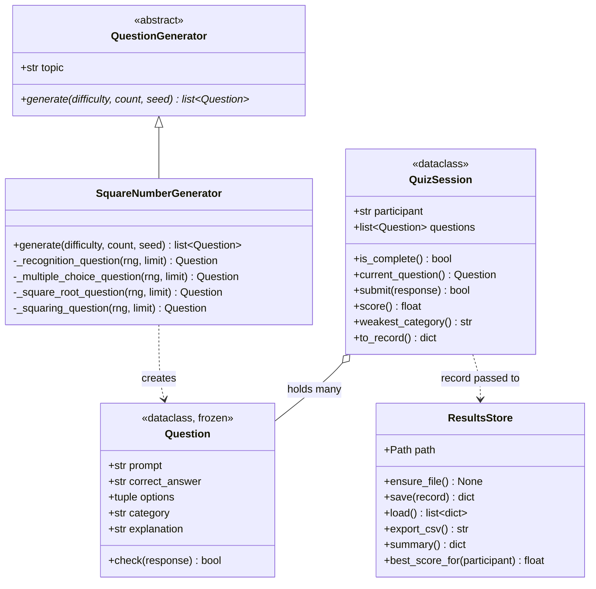
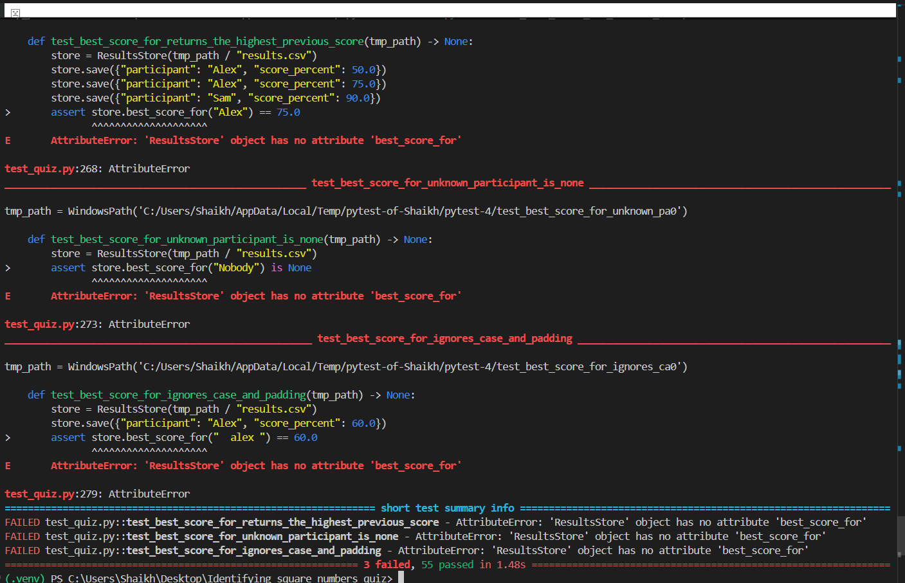
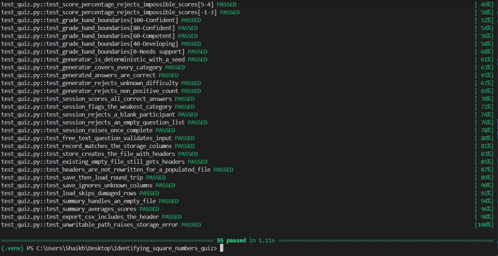

# square numbers quiz

A self-service numeracy practice tool built with [python](https://www.python.org/)
And [Streamlit](https://Streamlit.io/). Users answer questions about square numbers,
See explanations, and have their scores saved to CSV, allowing program managers to follow a cohort over time.

**github repository**: [identifying_square_numbers_quiz](https://github.com/sha1kh02/identifying_square_numbers_quiz)

## introduction

As a service desk analyst at IBM supporting 50 team members across six projects, tracking SLA targets and ticket resolution metrics makes numerical analysis essential to my daily responsibilities. However, while apprentices must complete mandatory numeracy assessments, they lack dedicated preparation materials. Trainees currently rely on fragmented online resources that offer no diagnostic insight, while program managers have no centralized method to assess collective weaknesses without manual data collection.

To bridge this gap, I developed a self-service practice tool initially focused on square numbers, covering root calculation, squaring, and pattern recognition. Designed as an instructional aid rather than a simple test, the tool provides immediate rationales after each question. Upon completion, users receive an overall score, a competency band, and a breakdown of their most frequent errors. Each attempt is automatically logged to a CSV file, allowing training managers to monitor cohort performance and identify shared areas of difficulty without manual overhead.

Built with an abstract interface, the question generator decouples content logic from the storage layer. This modular architecture allows the tool to readily scale beyond numeracy into broader operational topics—such as service desk policies and escalation procedures—to support ongoing onboarding and refresher assessments.

## design section









### functional requirements

| ID | Requirement | Priority |
| --- | --- | --- |
| FR-1 | Participant enters a name and chooses difficulty and question count | Must |
| FR-2 | Questions generated across four categories: recognition, multiple choice, square root, squaring | Must |
| FR-3 | Free-text answers validated as whole numbers before marking | Must |
| FR-4 | Each answer is marked and explained | Must |
| FR-5 | Completion shows a percentage score and competency band | Must |
| FR-6 | Completion identifies the most-missed category | Should |
| FR-7 | Each attempt is written to a CSV file with a timestamp | Must |
| FR-8 | Results view shows all attempts, total, average and most-missed category | Must |
| FR-9 | Results exportable as a CSV download | Must |
| FR-10 | Returning participants see their best previous score | Could |
| FR-11 | A new topic can be added without changing session, storage or interface code | Should |

### non-functional requirements

| ID | Requirement | How it is met |
| --- | --- | --- |
| NFR-1 | Usable without training | Single-screen flow, three inputs |
| NFR-2 | Results survive restart | Written to disk, not held in memory |
| NFR-3 | Readable without specialist tooling | CSV, opens in Excel |
| NFR-4 | Generation reproducible for testing | Optional seed creating a local `random.Random` |
| NFR-5 | Invalid input never crashes the app | Typed exceptions caught at the interface layer |
| NFR-6 | Logic testable without a browser | No Streamlit or file imports in `quiz_logic.py` |
| NFR-7 | Suite fast enough for CI | Runs in about one second |

### tech stack

| Layer | Choice | Rationale |
| --- | --- | --- |
| Interface | [Streamlit](https://streamlit.io/) | Browser UI from plain Python. Tkinter offers no deployment path; Flask needs routing and templating for no gain at this scale |
| Persistence | Standard-library [`csv`](https://docs.python.org/3/library/csv.html) | Small append-only log staff open in Excel. A database adds a dependency and schema for no benefit |
| Arithmetic | [`math.isqrt`](https://docs.python.org/3/library/math.html#math.isqrt) | Exact integer square root, avoiding the float rounding of `int(n ** 0.5)` |
| Testing | [pytest](https://docs.pytest.org/) | Parametrised tests; `tmp_path` isolates storage tests from the real results file |
| CI | [GitHub Actions](https://docs.github.com/en/actions) | Runs the suite on a clean machine against two Python versions |

### code architecture

three distinct layers exist in the code architecture. Each layer resides in its own module. Dependencies flow from bottom up. The Interface depends on the logic and the storage layer whereas neither the logic nor the storage layer know anything about each other. `quiz_logic.py` does not import anything from outside the standard library and does not interact with the file system. This ensures it is testable in CI without ever needing to launch a browser.



In the class diagram i drew a dotted line representing the relationship between `QuizSession` and the Results store. I did so intentionally: the session never calls the Results store directly. Instead, it generates a dictionary via `to_record()`, which `app.py` forwards on to write out. Therefore, `QuizSession` and `ResultsStore` have no direct dependency. Domain errors share a `QuizError` base-class; `StorageError` remains external since a failed disk drive is not a broken rule. The timestamp is added in the Results store layer to ensure `QuizSession` is deterministic for purposes of testing.

## development section

### pure functions

The core pure function is `is_square` which determines if an arbitrary number is a perfect square.

```python
def is_square(n: int) -> bool:
    """Return ``True`` when ``n`` is a perfect square."""
    if isinstance(n, bool) or not isinstance(n, int):
        raise TypeError(f"is_square expects an integer, got {type(n).__name__}")
    if n < 0:
        return False
    root = math.isqrt(n)
    return root * root == n
```

`math.isqrt` performs integer-only arithmetic thus avoids roundoff error where floating-point arithmetic may introduce it -- `int(10**16 ** 0.5)` is susceptible to roundoff error and there is a test case for that. The boolean check exists since python considers `bool` to be a subclass of `int`, so `is_square(True)` would otherwise evaluate true. Typed exceptions are instead thrown as validation rather than returning sentinel values callers might reasonably ignore.

```python
def parse_integer_answer(raw: object) -> int:
    text = normalise_answer(raw)
    if not text:
        raise InvalidAnswerError("Enter an answer before submitting.")
    try:
        return int(text)
    except ValueError as exc:
        raise InvalidAnswerError(f"'{raw}' is not a whole number.") from exc
```

### Object-oriented design

`QuestionGenerator` defines an abstract base class (abc) that describes what every topic must fulfill; `SquareNumberGenerator` is the first implementation and cycles through FOUR private builder methods so that category are evenly distributed regardless of how many questions are presented in a single quiz.

```python
builders = (self._recognition_question, self._multiple_choice_question,
            self._square_root_question, self._squaring_question)
return [builders[i % len(builders)](rng, limit) for i in range(count)]
```

`seed` creates a local `random.Random` Object versus using random.random globally; this makes generating reproducible for testing purposes without polluting global state. `question` is defined as a frozen dataclass so once generated questions cannot be modified. `QuizSession` keeps track of progress and exposes derived state as properties; `weakest_category` returns the most-frequently missed category; if there are tied categories, it breaks ties by first seen to maintain determinism.

### storage

File-access is entirely encapsulated within `storage.py`. `save` will filter-incoming dictionaries against known column names; hence unknown keys are simply ignored; `load` will skip rows without participant so one hand-edited line cannot break history. `ensure_file` verifies file size rather than existence; see evaluation.

```python
if self.path.exists() and self.path.stat().st_size > 0:
    return
```

### Interface

`app.py` is very thin. Since Streamlit re-runs the entire script on each interaction, progress lives in `st.session_state`. When advancing session after submission of question answers, feedback renders before continuing (i.e., next question); hence feedback state stores previous question asked. Routing holds view of current question until feedback is rendered.

```python
st.session_state.feedback = {
    "correct": was_correct, "answer": question.correct_answer,
    "explanation": question.explanation, "prompt": question.prompt,
    "position": session.answered,
}
```

### Continuous integration

`.github/workflows/ci.yml` runs on every push to main: installs dependencies; verifies app imports correctly; runs test suite under both py 3.11 & 3.12. `fail-fast: false` indicates that one version failing does not cancel out other versions.
CI runs on clean machine w/ only what declared by requirements.txt: catches unpushed files / undeclared dependencies local run can't catch. It was deployed in second commit, installing dependencies only, because pytest with no test cases exits non-zero.

```yaml
    strategy:
      fail-fast: false
      matrix:
        python-version: ["3.11", "3.12"]
```

## testing section

### Strategy and methodology

There are three ways: each covers what others don't. **Unit tests** cover domain logic and storage layer; parameterized tests cover input range and tmp_path used for storage layer testing isolation.
**exploratory manual testing** covers Interface because Streamlit's re-run model makes behavior dependent upon session-state across script runs which Unit tests don't exercise — every defect found in Interface were manually tested.
**Continuous integration** runs entire suite again on clean machine; catches environment problems rather than adding coverage. Unit tests answer "do rules work?", manual tests answer "does application work?", CI answer "does it work anywhere but my laptop?"

### manual test outcomes

| ID | Area | Steps | Expected result | Actual result | Status |
| --- | --- | --- | --- | --- | --- |
| MT-01 | Setup validation | Blank name, click Start quiz | Warning shown, quiz does not begin | Quiz does not begin | Passed |
| MT-02 | Setup validation | Name of spaces only, Start quiz | Same warning; whitespace rejected | Same warning appears | Passed |
| MT-03 | Quiz length | Select 8 questions, count them | Caption reads "Question 1 of 8"; 8 asked | Caption reads correctly | Passed |
| MT-04 | Difficulty | Run Easy then Hard, compare numbers | Hard uses visibly larger values | Visibly larger values used | Passed |
| MT-05 | Multiple choice | Submit without selecting an option | Warning shown, no answer recorded | Correct prompt displayed | Passed |
| MT-06 | Free-text | Type `abc` and submit | Warning that it is not a whole number | Question stays open | Passed |
| MT-07 | Free-text | Submit with the box empty | Warning to enter an answer | Warning displayed | Passed |
| MT-08 | Input tolerance | Enter `  8  ` with spaces | Padded input accepted, marked correct | Accepted and marked correct | Passed |
| MT-09 | Feedback | Answer one right, one wrong | Success and failure messages, both explained | Appropriate messages displayed | Passed |
| MT-10 | Final question | Answer the last question | Feedback and explanation shown, button reads "See results", results appear only after clicking it |  | |
| MT-11 | Scoring | Get 3 of 4 right | 75.0%, band "Competent", "3 correct out of 4" | Percentage and band correct | Passed |
| MT-12 | Weak area | Get both free-text questions wrong | Warning names the most-missed category | Category displayed correctly | Passed |
| MT-13 | Perfect score | Answer all correctly | "Nothing to review", band "Confident" | Band reads correctly | Passed |
| MT-14 | Review panel | Expand "Review your answers" | All questions with answers and explanations | All listed correctly | Passed |
| MT-15 | Persistence | Finish a quiz, open Results | Attempt appears with a timestamp | Appears with timestamp | Passed |
| MT-16 | Persistence | Restart the app, open Results | Previous attempts still listed | Data survives restart | Passed |
| MT-17 | Aggregates | Complete three quizzes | Attempt count and average update | Updates correctly | Passed |
| MT-18 | Export | Download the CSV and open it | Header row plus one row per attempt | Results displayed correctly | Passed |
| MT-19 | Retake | Click "Take it again" | Returns to setup, previous attempts kept | Behaves as expected | Passed |
| MT-20 | No double-save | Switch tabs repeatedly after finishing | Attempt count rises by exactly one | Rises by exactly one | Passed |
| MT-21 | Best score | Take two quizzes under the same name | Best previous score shown at setup | [RECORD] | |
| MT-22 | Best score | Start under an unused name | No best score shown, no error | [RECORD] | |

### unit testing outcome





## documentation section

### user documentation

Enter your name on the **Quiz** tab, choose a difficulty (*Easy* stays inside the
times tables, *Medium* to 25, *Hard* to 50) and pick 4, 8 or 12 questions, then
select **Start quiz**. Answer each question and select **Submit answer**; you are
told whether you were right and shown an explanation before continuing. At the
end you see your score, a band and the question type you got wrong most often,
with **Review your answers** listing everything again.

| Score | Band |
| --- | --- |
| 80%+ | Confident |
| 60–79% | Competent |
| 40–59% | Developing |
| Below 40% | Needs support |

The **Results** tab shows every attempt with the total, average score and most
commonly missed category, and exports the history as CSV. Use the same name each
time to track your progress.

### technical documentation

Requires Python 3.11 or later.

```bash
git clone https://github.com/Sha1kh02/identifying_square_numbers_quiz.git
cd identifying_square_numbers_quiz
python -m venv .venv
.\.venv\Scripts\Activate.ps1      # Windows; source .venv/bin/activate elsewhere
pip install -r requirements.txt
streamlit run app.py              # opens at http://localhost:8501
pytest -v                         # run the tests
```

Storage tests use pytest's `tmp_path` fixture, so they never touch
`quiz_results.csv`. Responsibilities split across `quiz_logic.py` (rules, no
I/O), `storage.py` (CSV), `app.py` (interface) and `test_quiz.py` (tests). To add
a topic, subclass `QuestionGenerator`, implement `generate`, add the new category
keys to `CATEGORY_LABELS` and instantiate it in `start_quiz`; nothing else
changes. Attempts append to the gitignored `quiz_results.csv`. CI results appear
under the repository's
[Actions](https://github.com/Sha1kh02/identifying_square_numbers_quiz/actions) tab.

## Evaluation Section

### What Went Well

Dividing the code into three layers paid off most. Since `quiz_logic.py` never 
touches either Streamlit or the file system, the suite takes less than a second 
to run and needed no configuration in CI. If the rules had been put in with the 
interface code, testing them would have required running a browser. Slow enough 
that I probably wouldn't have done it. The design constraint is what allowed this 
to be tested practically.

Placing the pipeline into the second commit meant each push was automatically 
checked (in addition to being checked once at the end) instead of just once. Python 
version 3.13 is the version I'm running locally, so CI was the only location in 
which the code could actually run using the versions it says it supports. Writing 
the `best_score_for` feature test-first was the part I found most instructive. This 
forced me to decide what `best_score_for` should return for an unknown 
participant and how it should handle capitalization, before writing a single line 
of it.

### What Could Have Been Improved

What I learned by far was from the three bugs a passing test suite did not find.

Two were in `app.py`. Once you submitted your answer, both the title/header 
and the progress bar moved onto the next question, but the message showing up at 
the bottom still said you got the previous one wrong. So for example if you answered 
a question about 7^2, there'd be an explanation for that down below a heading 
asking about 8^2. The same issue caused the last question's explanation to never 
show up at all. In fact both issues arose from reading session state after `submit()` 
had altered it, a hazard specifically due to how Streamlit causes the entire script 
to run again on every user interaction. Not one of these 58 tests failed during 
this time, since they live entirely within the presentation layer of the application, 
which isn't exercised by this test suite.

The third was harder to identify and had to survive thanks to the tests. When I 
first created `ensure_file`, I didn't check whether `quiz_results.csv` already exists 
before creating a header row. As a result, I left an empty `quiz_results.csv` in 
my repository from when I initially scaffolded out the project, so a header wasn't 
created and each subsequent entry was added without one. This meant `csv.DictReader` 
then treated the very first entry as the column names. Everything looked fine: 
the application showed each submission as successful, showed each participant's 
score correctly on their score screen, all tests were green, and only the results 
view was blank with no exception messages to follow along. I thought the 
submission was silently failing, which led me to search in completely the wrong 
place. The true source of the problem lay in that every storage test starts in a 
clean temp directory, so none of them has ever seen an existing empty file. The tests 
shared an implicit assumption about where they started from and that's exactly where 
the bug lived. To fix this, `ensure_file` now checks size of files instead of existence.
And there are now two regression tests.

This is why I continued doing some level of manual testing rather than considering 
this full automated suite sufficient: unit tests ensure that rules are correct, not 
that an application functions.

There were other differences between the prototype and finished application:
while the wire frames called for grades like "Good" and a "try again," etc., for incorrect
answers, while the implementation calls for four competency levels and doesn't do "try again."
Also multiple-choice questions and the results page weren't even included in the
prototype; things I hadn't considered until I actually started making the application.

As mentioned earlier, every module was checked individually and nothing was pushed
until everything had run successfully on my local machine. Therefore it was always easy
for me to tell what broke the build vs. having to sift through a long diff to figure
out what caused problems. But what it also doesn't show is that most of the modules were
written and functioning prior to that first commit; what my git history shows is simply
when I landed work — not necessarily when I wrote it. Using TDD effectively only really
came into play near the end of my development process — and this would be the one thing I'd
do differently.

### Limits And Next Steps

Right now every participant can see every others' submissions; participants report 
their own scores; and there are no locks preventing concurrent writes to quiz_results.csv.

Most importantly though, right now the application will only run on your computer locally,
so any results generated are shared only among people who use the same machine.
A major gap relative to what students in cohorts used it for and who I designed it for. 
After that I think I would need to get Streamlit's AppTest harness installed in CI so 
I can detect presentation-layer failures that aren't detected now.

## References

- [Streamlit Documentation](https://docs.streamlit.io/)
- [Session State](https://docs.streamlit.io/develop/concepts/architecture/session-state)
- [`math.isqrt`](https://docs.python.org/3/library/math.html#math.isqrt)
- [`csv`](https://docs.python.org/3/library/csv.html)
- [`dataclasses`](https://docs.python.org/3/library/dataclasses.html)
- [`abc`](https://docs.python.org/3/library/abc.html)
- [pytest](https://docs.pytest.org/)
- [`tmp_path` Fixture](https://docs.pytest.org/en/stable/how-to/tmp_path.html)
- [GitHub Actions](https://docs.github.com/en/actions)
- [Mermaid Syntax](https://mermaid.js.org/intro/)